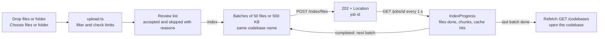
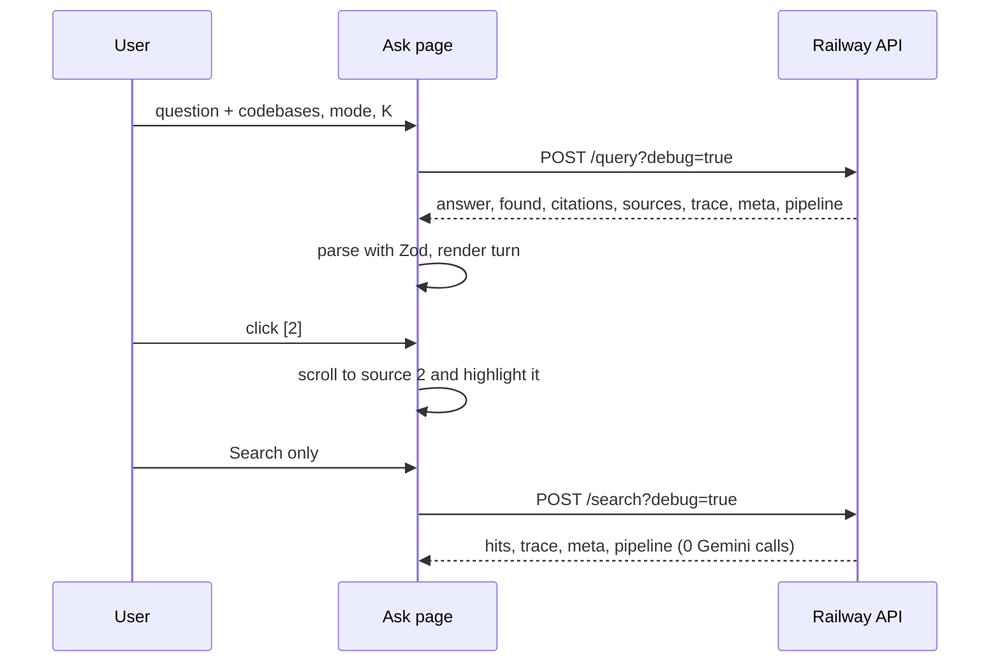

# Frontend Plan — Codebase RAG UI

Frontend design for [PLAN.md](PLAN.md). It consumes the deployed API ([BACKEND_PLAN.md](BACKEND_PLAN.md),
[backend/DEPLOY.md](backend/DEPLOY.md)), live at https://backend-production-cf2a.up.railway.app. The stack and
quality approach are the same as Labs 2–3. What is different this time comes from the backend:

- **Answers are synchronous** (`POST /query` returns in 1–8 s), so there is no SSE. Only indexing and the full
  evaluation are background jobs, followed by polling `GET /jobs/{id}`.
- **Every answer carries its evidence:** numbered sources, scores from each retriever, a trace with timings,
  and (with `?debug=true`) every step from the question to the exact prompt.
- **Most of the demo costs 0 Gemini calls:** two sample codebases are already indexed, search never calls the
  model, the 20 suggested questions are cached, and the stored evaluation reports are free to read.

## 1. Scope

| Lab requirement | How it is met |
|---|---|
| Web interface with two sections: Indexing and Querying | Three pages with a top navigation: **Ask** (`/`), **Codebases** (`/codebases`, the indexing section) and **Evaluation** (`/evaluation`). Each page has its own URL, so a view can be shared |
| File upload area for indexing code files | **Upload panel** on Codebases: drag and drop, *Choose files*, or *Choose folder* (a whole project). Files are filtered and checked in the browser first (§5), sent in batches, and each batch's job progress is shown |
| Chat-like interface for asking questions | **Ask page**: a conversation of question → answer turns, a composer at the bottom, and the codebases, mode and K above it. Each question is answered on its own (PLAN §5): earlier turns are shown but not sent to the model |
| Results showing answer + source code snippets used | Each answer has clickable **`[n]` citations** linked to **source cards**: codebase, `path:start–end`, symbol, the code with line numbers, and the scores (vector, BM25, RRF, rank in each list) |
| Evaluation metrics display panel | **Evaluation page**: the stored full report (retrieval P/R/MRR/nDCG, judge scores, deterministic checks, judge sanity check, per category and per question), the 72-row comparison grid, and buttons to run a retrieval evaluation (0 calls) or replay the full one (0 calls in production) |
| Responsive design | One column on phones, with the composer fixed at the bottom of the Ask page. On wide screens Ask has the conversation and a sources column side by side. Code blocks and wide tables scroll inside their own box, never the page |

Extensions, and additions driven by the backend:

| Addition | Why |
|---|---|
| **Search mode selector** (`hybrid` · `vector` · `bm25` · `hybrid_rerank`), with a short hint for each | Extension: hybrid search. When the server reports the reranker as disabled (§9), `hybrid_rerank` is shown as unavailable with the reason, and the answer's meta line says which mode really ran |
| **Codebase picker** with several selection, and a codebase badge on every source | Extension: multiple codebases. "All" is a shortcut |
| **Cache badges**: "answer from cache", "query embedding cached" | Extension: caching. Read from the trace (`cache.llm`, `cache.query_embedding`) |
| **Rank columns on each source** (vector rank, BM25 rank, RRF) and, when present, the rerank move (`3 → 1`) | Extensions: hybrid search and reranking, made visible per result |
| **"How this answer was made"** panel (collapsed by default) | The pipeline debug view (BACKEND_PLAN §10.1): question → query embedding → ChromaDB candidates → BM25 candidates with matched terms → RRF merge → rerank → exact prompt → raw model output |
| **Trace bar** under each answer: one segment per span (`embed_query`, `vector_search`, `bm25`, `fuse`, `build_context`, `generate`, `validate`) with its milliseconds, plus tokens | Observability (PLAN §8) |
| **Suggested questions** from `GET /datasets/builtin`, grouped by category | A free demo: they hit the server's answer cache |
| **Search only** toggle in the composer | Same retrieval and source cards with **0 Gemini calls**. Offered automatically when the AI quota is used up |
| **Chunk viewer** on a codebase: pick a file and see how it was split (kind, symbol, lines, part n/m) | Shows the code-aware chunking, the lab's core idea |
| **Server stats** panel on Evaluation: `GET /stats` (calls today, cache hit rate, p50/p95 per step) | Observability |
| **Friendly RFC 9457 errors**, with a **Retry-After countdown** | As in Labs 2–3 |
| **Privacy notice** | The question and the retrieved code are sent to Google Gemini (free tier). Indexed code is readable by anyone using this demo for 24 hours. Don't upload private code or secrets |

## 2. Stack

| Tool | Choice |
|---|---|
| Node | 24 (`nvm use 24`) |
| Framework | Next.js 16 (App Router), TypeScript strict, Tailwind v4: same versions as Lab 3 |
| Validation | **Zod**. Every API response is parsed with a schema that mirrors the backend views. Invalid data is an error; it is never rendered half-valid |
| Code display | Plain `<pre>` with line numbers, no syntax highlighting (bundle size; a source is ≤ ~1,400 characters) |
| Charts | None. Metric bars are plain `<div>` widths with the number next to them, so nothing depends on color or a chart library |
| Tests | Vitest + Testing Library (unit, component) · Playwright with the installed Google Chrome (`channel: "chrome"`) + `@axe-core/playwright` |

**Reused from Lab 3, adapted:** `api.ts` (`request()` + Zod + `ApiError`), the Problem schema, `useCountdown`,
`ErrorBanner`, the multi-file upload reader from `files.ts`, the tabs pattern, the Vitest and Playwright configs
(production build as `webServer`, fake backend), `next.config.ts` with `turbopack.root`, and the Vercel steps.
SSE (`events.ts`), the diff view and the replay are not needed.

## 3. Pages and structure

| Route | Content |
|---|---|
| `/` **Ask** | Codebase picker, mode, K, *Search only* toggle · suggested questions (when the conversation is empty) · conversation · composer. Query string `?cb=shopflow,ledger&mode=hybrid&k=5` keeps the settings in the URL |
| `/codebases` | Codebase list (samples first, read-only badge; user codebases with "expires in 23 h" and *Delete*) · upload panel |
| `/codebases/[id]` | Codebase summary · file table (language, chunks, bytes, "fallback chunking" badge) · chunk viewer · *Ask about this codebase* (opens `/?cb=id`) |
| `/evaluation` | Tabs: **Report** (stored full report) · **Comparison grid** · **Run** (retrieval eval, full replay, custom dataset) · **Server** (`/stats`) |

```
frontend/
├── app/                    layout.tsx (nav, privacy notice, health dot) · page.tsx (Ask)
│   ├── codebases/          page.tsx · [id]/page.tsx
│   └── evaluation/         page.tsx
├── components/
│   ├── ask/
│   │   ├── AskApp.tsx          # settings ↔ URL, conversation state, submit, errors
│   │   ├── QuerySettings.tsx   # codebase picker, mode, K, search-only toggle
│   │   ├── Suggestions.tsx     # built-in questions by category
│   │   ├── Turn.tsx            # one question + its answer or search results
│   │   ├── AnswerText.tsx      # answer with [n] citations as buttons
│   │   ├── SourceCard.tsx      # location, scores, ranks, code with line numbers
│   │   ├── TraceBar.tsx        # spans in ms, tokens, cache badges, meta line
│   │   ├── PipelineView.tsx    # "How this answer was made" (§6.3)
│   │   └── Composer.tsx        # textarea, counter (500), Ask / Search
│   ├── codebases/
│   │   ├── CodebaseList.tsx    # cards, expiry, delete with inline confirm
│   │   ├── UploadPanel.tsx     # drop zone, file/folder pickers, review list, Index
│   │   ├── IndexProgress.tsx   # batch n/m, files done, chunks, cache hits, result
│   │   ├── FileTable.tsx
│   │   └── ChunkViewer.tsx
│   ├── evaluation/
│   │   ├── ReportView.tsx      # summary cards, by-category tables, checks, sanity
│   │   ├── QuestionTable.tsx   # per question: metrics, verdicts, expandable detail
│   │   ├── GridView.tsx        # filters + sortable table of the 72 rows
│   │   ├── RunPanel.tsx        # retrieval run, full replay job, custom dataset
│   │   └── StatsView.tsx
│   ├── MetricBar.tsx · Badge.tsx · Tabs.tsx · CodeBlock.tsx · ErrorBanner.tsx · PrivacyNotice.tsx
├── hooks/                  useJob.ts (poll /jobs/{id}) · useCountdown.ts · useConfig.ts (GET /config, §9)
├── lib/
│   ├── schemas.ts          # Zod: Codebase, CodebaseDetail, Chunk, Job, IndexResult, QueryResult, SearchResult,
│   │                       #      Source, Trace, Pipeline, Report, GridReport, Example, Stats, Health, Config, Problem
│   ├── api.ts              # codebases(), codebase(), chunks(), deleteCodebase(), indexFiles(), job(),
│   │                       # query(), search(), builtin(), evaluations(), evaluation(), evaluate(), stats(), health(), config()
│   ├── upload.ts           # read files/folders, filter (mirrors backend), batch into requests (§5)
│   ├── citations.ts        # split the answer into text and [n] / [1, 2] markers
│   ├── slug.ts             # codebase name rules and a suggestion from the folder name
│   └── format.ts           # ms, bytes, percentages, "expires in", line ranges
├── tests/                  unit + component (Vitest)
└── e2e/                    Playwright
```

## 4. Data flow

**Indexing.** The browser reads and filters the files, then sends them in batches to the same codebase. Each
batch is a background job, followed by polling.



**Asking.** One request per question. The answer, sources, trace and pipeline arrive together.



- **The conversation lives in the browser.** It is kept in `sessionStorage` (wrapped in `try/catch`), so a reload
  keeps it and a new tab starts clean. Nothing is sent back to the server; earlier turns never reach the model.
- **`?debug=true` is always sent.** The backend already computes the pipeline, so it costs no extra calls, and
  the panel stays collapsed until opened. If `meta.debug` is `"disabled"`, the panel is hidden.
- **Suggested questions are sent exactly as in the dataset** (its codebases, the default K and mode), so the
  retrieved code and the prompt match the cached answer: 0 calls.
- **Busy state.** While a question is in flight the composer is disabled and the turn shows "Searching the code…"
  then "Writing the answer…" after 1 s. The request timeout is 120 s (the server's Gemini timeout is 90 s).
- **Models loading.** `503 models-loading` right after a backend restart is retried automatically after
  `Retry-After` (a few seconds), up to 3 times, with a notice.

## 5. Upload rules (mirror the backend)

`upload.ts` applies the same rules as `domain/files.py` and the indexing limits, so nothing is sent that the server
would refuse. The values come from `GET /config` (§9), not from constants in the frontend.

| Rule | Result in the review list |
|---|---|
| Extension in the accepted list (`.py .pyi .ts .tsx .js .jsx .mjs .cjs .md .txt .json .toml .yaml .yml .cfg .ini`, and `.env.example`) | Accepted |
| Inside `node_modules`, `.git`, `dist`, `build`, `__pycache__`, `.venv`, `venv`, `.next` | Skipped: "dependency or build folder" (not listed one by one, only counted) |
| Lockfile (`package-lock.json`, `yarn.lock`, `poetry.lock`…) | Skipped: "lockfile" |
| A line longer than 1,000 characters | Skipped: "minified or generated" |
| Path longer than 200 characters, or a duplicate path | Skipped, with the reason |
| Codebase totals above 200 files or 1 MB | *Index* disabled: "Too much code: 1.4 MB of 1 MB. Remove some files." |

- **Paths** come from `webkitRelativePath` for a folder (its first segment, the folder name, is dropped) or the
  file name otherwise. They are relative, with `/` separators.
- **Codebase name**: lowercase letters, digits and `-`, 1–40 characters, starting with a letter or digit. It is
  suggested from the folder name (`Auction_Checklist` → `auction-checklist`). The names `shopflow` and `ledger`
  are refused in the browser (read-only samples).
- **Batches**: files in path order, a new batch when the next file would pass 50 files or 500 KB. A batch fails
  as a whole; earlier batches stay indexed, and *Retry* resends from the failed batch.
- **Re-indexing** the same name is allowed: unchanged files are skipped by the server and shown as "unchanged".

## 6. Ask page details

### 6.1 Answer

- `AnswerText` splits the text with the same marker grammar as the backend (`[2]`, `[1, 2]`, `[1,3]`). Each
  number becomes a button "Source 2" that scrolls to that source card and highlights it for 2 s. A number with no
  matching source is shown as plain text (cannot happen when `grounded` is true).
- The answer is rendered as **text**, never as HTML. Inline `code` in backticks is the only formatting.
- `found: false` shows a neutral box: "The indexed code doesn't answer this", plus the sources that were checked.
- `grounded: false` (rare: invalid citations after the repair) shows a warning badge "Citations could not be
  verified".

### 6.2 Sources and trace

- **Source card**: `n`, codebase badge, `path:start–end`, symbol and signature, part "2/3" when a unit was split,
  the code with real line numbers, and a scores row: `vector 0.68 · BM25 7.34 · RRF 0.016 · ranks: vector 1,
  BM25 1`. A missing rank shows "—" ("not in that list"). Cards for cited sources come first, marked "cited".
- **Trace bar**: proportional segments per span with labels and milliseconds, `total_ms`, tokens in / out, and
  badges for each cache hit. The meta line: model, prompt version, embedder, chunker version, mode that ran, K.

### 6.3 "How this answer was made"

Collapsed `<details>`. Each step is a numbered section with a one-line explanation for readers new to RAG:

| Step | Shown as |
|---|---|
| 1 Question | The text sent |
| 2 Query rewrite | "Not used" (`null` today) |
| 3 Query embedding | Model, 384 dimensions, cached or not, ms |
| 4 Vector search (ChromaDB) | Table of the 20 candidates: rank, location, similarity |
| 5 Keyword search (BM25) | Table: rank, location, score, **matched terms** as chips |
| 6 Fusion (weighted RRF) | Table: rank, location, RRF score, vector rank, BM25 rank. Rows that reached the top K are marked |
| 7 Rerank | Table with rank moves (`3 → 1`), or the skip reason: "Reranker disabled on this server" / "Mode hybrid" |
| 8 Prompt | System and user text in two scrollable code blocks, prompt version, estimated tokens, chunks sent / dropped, *Copy* buttons |
| 9 Model output | Raw JSON output, tokens, cached. With a repair: each attempt with its errors and the repair message |

`/search` stops at step 7.

## 7. Evaluation page

- **Report tab** (default): the stored `full` report (`GET /evaluations/full`).
  - Summary cards: Recall@5, MRR, nDCG, faithfulness, relevance, correctness, citations valid (20/20), unanswerable
    handled, judge sanity check (4/4), real / cached calls, latency p50 / p95.
  - By-category tables for retrieval and judge scores, with metric bars.
  - **Per-question table**: id, category, question, R@K, MRR, the three judge scores, check icons with text. A row
    expands to the retrieved list (relevant ✓ with text), the answer, the judge's reasons, missing mentions.
  - A short "How to read this" note: what each metric means and that the judge is the same model that answers,
    so the scores are an upper bound (EVALUATION.md §5).
- **Comparison grid tab**: `GET /evaluations/grid`, 72 rows. Filters for embedder, chunking strategy, mode and K;
  sortable columns (P, R, MRR, nDCG, context chars, latency). The default configuration is highlighted and
  `best_at_5` is shown above the table.
- **Run tab** (all 0 Gemini calls in production):
  - *Run retrieval evaluation*: K and mode selectors → `POST /evaluate {mode: "retrieval"}` (synchronous) → the
    same summary and per-question views. A badge compares it with the stored baseline.
  - *Replay full evaluation*: `POST /evaluate {mode: "full"}` → job → `useJob` polling → report. The note says
    production replays cached answers only (`FULL_EVAL_MAX_CALLS=0`).
  - *Custom dataset* (retrieval only): paste or upload a JSON list (1–30 examples, the dataset format, with a
    *Download template* built from two built-in examples). Validation errors point at the example and field.
- **Server tab**: `GET /stats`, refreshed on open and with a *Refresh* button.

## 8. API client and errors

- `NEXT_PUBLIC_API_URL` is set at build time; the default is `http://localhost:8000`.
- Timeouts: **120 s** for `/query`, **60 s** for `/evaluate` (retrieval runs in a few seconds), **30 s** otherwise.
- Errors become `ApiError { kind, title, message, retryAfter?, fieldErrors? }`:

| Response | `kind` | Shown to the user |
|---|---|---|
| 400 `malformed-request` / 422 `validation-error` | `validation` | Field errors, with pointers mapped to labels (`#/question` → "Question", `#/files/3/path` → the file's path) |
| 422 `unsupported-file-type` | `unsupported` | Problem `detail` (should not happen: filtered in the browser) |
| 422 `empty-index` | `empty` | "Nothing is indexed in the selected codebases yet" + link to Codebases |
| 413 `input-too-large` | `too_large` | Problem `detail` (states the limit) |
| 404 `codebase-not-found` | `not_found` | "This codebase no longer exists (user codebases expire after 24 h)" + refetch the list and drop it from the picker |
| 404 `job-not-found` / `evaluation-not-found` | `not_found` | "This job/report no longer exists" |
| 409 `codebase-read-only` | `read_only` | "Sample codebases can't be changed. Choose another name." |
| 409 `too-many-codebases` | `full` | "The demo holds at most N uploaded codebases. Delete one or try later." + the list |
| 429 `rate-limited` | `rate_limited` | "Too many questions — try again in N s" + countdown; *Ask* disabled |
| 503 `llm-quota-exhausted` | `quota` | "Today's free AI quota is used up. Search still works." + *Search instead* + countdown (shown as "about 5 h") |
| 503 `llm-unavailable` / `busy` | `busy` | "The service is busy" + countdown |
| 503 `models-loading` | `loading` | "The search models are starting" + automatic retry (§4) |
| 502 `llm-bad-response` | `bad_answer` | "The model's answer wasn't usable. Try again or rephrase." |
| 504 `wait-timeout` | `timeout` | Not used: the UI never sends `?wait=true` |
| Other non-2xx | `server` | Generic message with the problem title |
| `fetch` throws / timeout | `network` / `timeout` | "Can't reach the service" / "took too long" |
| Body fails its Zod schema | `invalid_response` | "Unexpected response from the server" |

A failed **index job** is not an `ApiError`: the job ends in `failed` with `error {title, detail}`, shown in
`IndexProgress` with *Retry*. Skipped files inside a completed job are listed with the server's reasons.

## 9. Backend additions needed

Small, 0-call changes to the API, made before the frontend work and covered by backend tests:

| # | Change | Why |
|---|---|---|
| B1 | **`GET /config`**: `{limits: {max_files_per_request, max_bytes_per_request, max_files_per_codebase, max_bytes_per_codebase, max_user_codebases, codebase_ttl_hours, max_k, question_max_chars}, extensions, skipped_dirs, lockfiles, defaults: {k, mode}, modes: [{id, available, reason}], pipeline_debug}` | The browser checks mirror the server without copying constants. `modes` tells the UI that `hybrid_rerank` is unavailable when `RERANK_MODEL` is empty |
| B2 | **`/health` adds `reranker: "ready" \| "loading" \| "disabled"`** | The health dot in the header can say "reranker disabled" |

## 10. Accessibility and UX details

- **Conversation**: `role="log"` with `aria-live="polite"`; a new answer is announced as "Answer ready, 3
  sources" (not the whole text). Focus stays in the composer after sending.
- **Citations** are real `<button>`s with `aria-label="Source 2: auth/service.py lines 12–40"`.
- **Badges** (cited, cached, read-only, relevant, check results, mode unavailable) always carry **text**, never
  color alone. Text colors meet AA: orange-700 / zinc-600 or darker on white.
- **Tabs** (Evaluation) follow the WAI-ARIA pattern: `role="tablist"`, arrow keys, `aria-selected`.
- **Scroll regions** (code, prompt, grid table, pipeline tables) have `tabIndex={0}`, `role="region"` and an
  `aria-label` (Lab 3 axe finding).
- **Upload**: the drop zone is also a button that opens the file picker; the review list is a table with a caption
  and a summary line read by screen readers ("14 files accepted, 3 skipped, 40 KB of 1 MB").
- **Delete** asks for an inline confirmation ("Delete auction-checklist and its 48 chunks?").
- **Mobile at 375 px**: no horizontal page scroll; settings collapse into a "Settings: shopflow · hybrid · K 5"
  summary that opens on tap; the sources column moves under each answer.
- **Keyboard**: Enter sends, Shift+Enter adds a line; `/` focuses the composer when focus is not in a field.

## 11. Quality strategy

| Level | What | Real Gemini calls |
|---|---|---|
| Unit | `api.ts` (every row of §8, timeouts, Zod rejection), `upload.ts` (every rule of §5, batching edges), `citations.ts` (single, grouped, unknown markers), `slug.ts`, `format.ts`, schemas against recorded real responses | 0 (fetch faked) |
| Component | Behaviors C1–C14 below | 0 (api mocked) |
| E2E local | Real backend with **`LLM_MODE=fake EMBED_MODE=fake`** (hashing embedder, demo LLM: fast and deterministic) + the production build of the frontend | **0** |
| E2E production | Samples, a suggested (cached) question, search, evaluation pages, mobile, a11y, and one upload + one new question | **1** expected (the new question) |
| Also | `tsc`, ESLint, `next build`, coverage ≥ 80 % | 0 |

Recorded responses for the schema tests come from the live API (`/codebases`, `/search?debug=true`,
`/evaluations/full`, `/evaluations/grid`, a cached `/query?debug=true`), saved in `tests/fixtures/`.

**Component tests**

| ID | Test |
|---|---|
| C1 | Ask initial render: picker filled from `/codebases`, defaults from `/config`, suggested questions grouped by category, privacy notice; *Ask* disabled with no question |
| C2 | Settings sync with the URL (`?cb=…&mode=…&k=…`) both ways; an unknown codebase in the URL is dropped with a notice |
| C3 | `hybrid_rerank` shows as unavailable with its reason when `/config` says so |
| C4 | Sending a question: request body and `?debug=true`, busy state, double submit blocked, turn rendered with answer, sources and trace |
| C5 | Citations: `[1, 2]` becomes two buttons; clicking one focuses and highlights the source; cited sources first |
| C6 | `found: false` box; `grounded: false` warning; cache badges from the trace |
| C7 | Pipeline panel: all 9 steps from a recorded response; rerank skip reason; the search version stops at step 7 |
| C8 | Search only: calls `search`, renders hits without an answer; *Search instead* appears on a 503 quota error and re-runs the same question as a search |
| C9 | Errors: 429 and 503 countdowns disable *Ask* until 0 (fake timers); `models-loading` auto-retries; 404 codebase drops it from the picker |
| C10 | Upload: folder selection builds paths without the root folder; skipped files with reasons; totals vs limits; name suggestion and validation; sample names refused |
| C11 | Indexing: batches sent in order, progress from polled jobs, result summary; a failed batch shows its error and *Retry* resumes from it |
| C12 | Codebase list: read-only samples without *Delete*; expiry text; delete with confirmation; `too-many-codebases` message |
| C13 | Evaluation report: summary cards, category tables, per-question expand; grid filters and sorting; retrieval run and full-replay job polling |
| C14 | Custom dataset: invalid JSON and server field errors shown per example; template download |

**E2E** (Playwright, fake backend, production build)

| ID | Test |
|---|---|
| E1 | Upload a small folder (`setInputFiles` on the folder picker) → batches complete → the codebase appears with its file count → chunk viewer shows a file's chunks → delete it |
| E2 | Ask a suggested question on `shopflow` → answer with citations → click `[1]` → the source is highlighted |
| E3 | "How this answer was made" opens and shows the candidates, matched terms and the prompt |
| E4 | Search only and a two-codebase question (`shopflow` + `ledger`): sources carry both badges |
| E5 | Evaluation: report and grid render from stored reports; a retrieval run completes; full replay job completes |
| E6 | Errors with `page.route`: backend down → network message; 429 with `Retry-After` → countdown; 503 quota → *Search instead* works |
| E7 | Mobile 375×667: no horizontal scroll on all three pages, including an open pipeline panel and a source card |
| E8 | Accessibility: axe finds no serious/critical violations on Ask (empty and with an answer and an open pipeline), Codebases (with the review list), Evaluation (each tab) |
| E9 | Production: E2 (cached, 0 calls), E3, E5 (0 calls), E7, E8, plus E1 with the `auction-checklist` test project and one new question about it (1 call) |

## 12. Deployment (Vercel)

Same steps as Labs 2–3:

```bash
cd TA_Module4/Lab_module4/frontend
vercel link --yes --project taller-codebase-rag
printf 'https://backend-production-cf2a.up.railway.app' | vercel env add NEXT_PUBLIC_API_URL production
vercel --prod --yes
# then, from ../backend (redeploys the API with the new CORS origin):
railway variables --set "FRONTEND_ORIGIN=http://localhost:3000,https://<vercel-domain>"
```

**Post-deploy checks:**
- The pages are public (200), and the bundle contains the Railway URL (chunks under `/_next/static/immutable/chunks/`).
- CORS from the Vercel origin: preflight, `DELETE`, error responses with `Retry-After` exposed (backend check V8,
  repeated with the real origin).
- E9.

Vercel needs no secret: the Gemini key stays on Railway only.

## 13. Implementation order

| # | Step | Gemini calls |
|---|---|---|
| 1 | Backend B1–B2 + tests; redeploy | 0 |
| 2 | Scaffold from Lab 3 (Next 16, Tailwind, Vitest, Playwright, ESLint); `schemas.ts` + `api.ts` + recorded fixtures + unit tests | 0 |
| 3 | Ask: settings, composer, turns, answer with citations, source cards, trace (C1–C6) | 0 |
| 4 | Pipeline panel, search only, errors and countdowns (C7–C9) | 0 |
| 5 | Codebases: `upload.ts`, upload panel, batching and job polling, list, detail, chunk viewer (C10–C12) | 0 |
| 6 | Evaluation: report, grid, run, custom dataset, server stats (C13–C14); responsive and a11y pass | 0 |
| 7 | E2E E1–E8 against the fake backend | 0 |
| 8 | Deploy to Vercel, CORS on Railway, E9, `frontend/DEPLOY.md`, README | 1 |

## 14. Definition of done

- [ ] Every lab frontend requirement (§1), with the 4 extensions visible in the UI
- [ ] typecheck, lint, unit and component tests (coverage ≥ 80 %), build: 0 Gemini calls
- [ ] E1–E8 pass locally against the fake backend
- [ ] Deployed to Vercel; CORS updated on Railway; E9 passes in production
- [ ] `frontend/DEPLOY.md` with the steps run; `frontend/README.md`; deviations recorded below

## 15. Implementation notes (deviations from this plan)

*To be filled in during implementation.*
