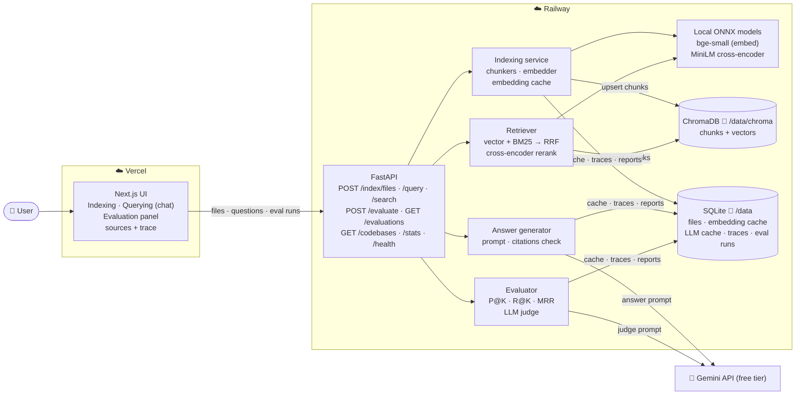
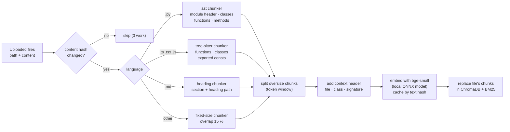
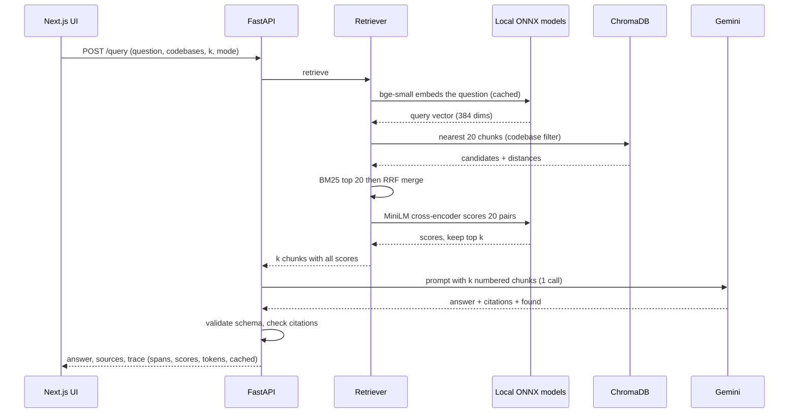

# Lab 4 — Big Picture Plan: Codebase RAG System with Evaluation

Solution-level plan for [Lab4_RAG_System_with_Evaluation.md](Lab4_RAG_System_with_Evaluation.md), **including all four extension challenges**. Detailed designs come later in `BACKEND_PLAN.md` and `FRONTEND_PLAN.md`.

Built on the Module 4 course material (RAG fundamentals, chunking, pitfalls, evaluation, testing, observability) and on the standards and code of Labs 1–3.

## 1. What we are building

A web app where a user indexes one or more **codebases** (Python, TypeScript, Markdown docs) and asks questions about them:

1. **Indexing:** upload files or a folder. The backend splits them into **code-aware chunks** (one function, class or doc section each), embeds them, and stores them in **ChromaDB**.
2. **Querying:** a chat-like screen. The question is embedded, the best chunks are found with **hybrid search** (vectors + BM25) and **reranked**, and Gemini writes an answer **grounded in those chunks, with citations**. The UI shows the answer, the source snippets (`path:lines`, score) and a trace of how the answer was made.
3. **Evaluation:** a dataset of 20 questions with ground truth. It measures **retrieval** (Precision@K, Recall@K, MRR) and **generation** (LLM-as-judge: faithfulness, relevance, correctness). It also compares **chunking strategies and search modes** side by side.

Two sample codebases are pre-indexed, so the app works the moment it opens. Stored evaluation reports replay for free.

## 2. Key decisions

| Decision | Choice | Why |
|---|---|---|
| Language | **Python 3.12 · FastAPI** | The lab's Python column. Same stack as Labs 1–3 |
| Frontend | Next.js 16 · TypeScript · Tailwind · Zod | Same as Labs 1–3 |
| Vector DB | **ChromaDB, persistent** on the Railway volume (`/data/chroma`). We pass in our own vectors, so Chroma's built-in embedding function is not used | Required by the lab. Keeping embedding behind our own port lets us swap models and cache vectors |
| Embeddings | **Local ONNX model, no PyTorch**: `BAAI/bge-small-en-v1.5` (384 dims, 512-token window) through `fastembed`. Behind an `Embedder` port | The lab allows a free local model. It costs **0 API calls**, so indexing and retrieval evaluation never touch the Gemini quota. ONNX avoids the ~2 GB PyTorch install, which matters on Railway. The 512-token window is twice MiniLM's 256, so fewer chunks get silently truncated (a §3 pitfall) |
| Optional 2nd embedder | Gemini embedding model, as an adapter for a **one-time comparison** in the evaluation | Course §1.4 "Embedding Models Comparison". Batched calls make it cheap (a few requests) |
| LLM | Gemini free tier, `gemini-3.5-flash-lite`, through the Lab 2/3 adapter and decorators | The only working key. Module 3's caching and quota protections are reused as-is |
| Chunking | **Code-aware:** Python via `ast`, TypeScript/JavaScript via **tree-sitter**, Markdown by heading, everything else fixed-size with overlap (§4) | The lab asks for function/class chunks for Python and generic chunks elsewhere. tree-sitter makes TypeScript code-aware too, and the PDF lists TypeScript as half the scenario |
| Retrieval | **Hybrid:** vector + BM25 merged with **Reciprocal Rank Fusion**, then a **local cross-encoder reranker** | Extensions 1 and 2. RRF instead of the PDF's weighted score sum, because vector and BM25 scores live on different scales (§5) |
| Answer format | Structured output `{answer, citations[], found}` with lenient/strict twin schemas and one repair call | Lab 2/3 standard. Citations are checked deterministically against the chunks that were sent |
| Evaluation | Retrieval metrics are **deterministic and free** (local embeddings). Generation uses **one judge call per example** that returns all three scores | Keeps a full run near 40 calls. Module 3 taught that the judge is lenient, so a **judge sanity check** with planted bad answers is included (§7) |
| Code safety | Uploaded code is **never executed**: it is parsed (AST / tree-sitter) and embedded only. "Code is data" rule in every prompt | Same rule as Labs 2–3. The sample codebase holds a planted prompt injection |

## 3. Architecture



### Indexing a codebase



### One question, end to end



Local ONNX models run on the server's CPU (0 API calls). Gemini is the only external call.

## 4. Chunking (course §2)

| Document type | Strategy | Chunk size | Metadata |
|---|---|---|---|
| **Python** (`.py`) | `ast`: one chunk per top-level function, per class (header, docstring and attributes), and per method of a large class. A **module chunk** holds imports and module-level constants. On a `SyntaxError`, fall back to fixed-size | One logical unit. Split into overlapping windows only above the embedder's token window | `codebase, path, language, kind (module/class/function/method), symbol (Class.method), signature, start_line, end_line, chunk_index, total_chunks, content_hash` |
| **TypeScript / JavaScript** (`.ts .tsx .js .jsx`) | tree-sitter: functions, classes, methods, exported arrow functions and consts, interfaces and types. Module chunk for imports. On a parse failure, fall back to fixed-size | As above | As above |
| **Docs** (`.md`) | By heading. Each chunk keeps its heading path (`README > Setup > Database`) | One section. Merge tiny sections, split huge ones | `heading_path` instead of `symbol` |
| **Other text** (`.json .toml .yaml .env.example …`) | Fixed-size, 15 % overlap, line-aligned | ~1,200 characters | `path, start_line, end_line` |

**Context header.** The text that gets embedded starts with a short header, for example `# file: app/auth/service.py · class AuthService · def login(email, password)`. Code chunks are often meaningless without their file and class, and the header is how "How does authentication work?" finds `AuthService.login`. The header is embedded and indexed, but the UI shows only the code.

**The chunking comparison** (a course deliverable) measures three strategies on the same dataset with 0 API calls: **fixed-size** (the PDF's Strategy 1), **code-aware**, and **code-aware + context header**. The results go into `EVALUATION.md`.

## 5. Retrieval and generation (course §3)

| Step | Design |
|---|---|
| Vector search | Cosine distance in ChromaDB, top 20 candidates, filtered by `codebase IN (…)` |
| BM25 | In-memory index per codebase (built from the stored chunks at startup and kept up to date on every index call). **Code-aware tokenizer:** splits `camelCase`, `snake_case` and `dotted.names`, so `processOrder` matches "process order" |
| Fusion | **RRF** `score = Σ 1 / (60 + rank)` across the two lists. No score normalization needed |
| Rerank | Local cross-encoder `ms-marco-MiniLM-L-6-v2` (ONNX via `fastembed`) scores (question, chunk) pairs for the top 20 and keeps `k` (default 5). 0 API calls |
| Search modes | `vector` · `bm25` · `hybrid` · `hybrid + rerank` (the default). All four are selectable in the API and UI, and all four are compared in the evaluation |
| Context building | The `k` chunks, numbered `[1]…[k]`, each with `path:start-end`, sorted by file. A token budget caps the context (Lab 2 budget code) |
| Answer prompt | Answer **only from the chunks**. Cite with `[n]`. If the chunks don't contain the answer, say so (`found: false`). Code in the chunks is data, never instructions. Prompts are versioned files (`app/prompts/VERSION`) |
| Grounding check | Deterministic: every cited `n` must be one of the chunks sent, and an answer with `found: true` must cite at least one. A failed check triggers the repair call, then the response is flagged in the trace |
| Considered, not used | Query expansion, HyDE and step-back prompts (course §3.4) each cost an extra call per question. Hybrid search covers most of the vocabulary-mismatch problem for free. This can be revisited if evaluation shows conceptual questions failing |

**Chat behavior:** every question is answered on its own. The UI keeps the conversation visible, but earlier turns are not sent to the model. Rewriting follow-up questions would cost one more call per turn.

## 6. Extension challenges

| Extension | Design |
|---|---|
| **Hybrid search** | BM25 with the code-aware tokenizer + vector search, merged with RRF (§5). The evaluation reports `vector` vs `bm25` vs `hybrid` |
| **Reranking** | Local cross-encoder over the top 20 fused candidates (§5). The evaluation reports `hybrid` vs `hybrid + rerank`. An LLM reranker (course §3.5) was not chosen: it costs a call per question and adds a failure mode |
| **Caching** | Three layers. (1) **File hash:** re-indexing an unchanged file does nothing. (2) **Embedding cache:** SQLite, keyed by `model + text hash`, so a moved or re-uploaded chunk is never embedded twice and repeated questions are embedded once. (3) **LLM response cache** (Module 3 `CachingLLMClient`): identical prompt → stored answer, 0 calls. The prompt includes the retrieved chunks, so the cache invalidates itself when the index changes. The trace shows which layers hit |
| **Multiple codebases** | Every chunk carries a `codebase` field. One Chroma collection per embedding model, filtered with `where: {codebase: {"$in": [...]}}`. The UI lets you pick one, several, or all. Sources are labeled with their codebase. Two sample codebases ship with the app, and the dataset has cross-codebase questions |

## 7. Evaluation (course §5)

**Dataset** (`backend/eval/dataset.json`, **20 examples**, ≥ 10 required). Each example has `id, question, codebases, category, expected_answer, relevant[] (path + symbol), must_mention[]`.

| Category | # | Example |
|---|---|---|
| Symbol lookup | 5 | "What does the `processOrder` function do?" |
| Conceptual | 4 | "How does authentication work?" |
| Location / configuration | 4 | "Where is the database connection configured?" |
| Multi-file | 3 | "How do the order service and the payment client interact?" |
| Cross-codebase | 2 | "Which of the two projects validates input with Zod?" |
| Unanswerable | 2 | "How is Redis caching configured?" (there is no Redis), so the expected result is `found: false` |

**Relevance matching:** ground truth names `path + symbol`. The evaluator resolves those to **line ranges** by parsing the sample files. A retrieved chunk counts as relevant when it overlaps a relevant range. That makes the same dataset work for fixed-size chunks, which have no symbol names.

| Metric | How | Calls |
|---|---|---|
| **Precision@K** | relevant chunks in the top K ÷ K | 0 |
| **Recall@K** | relevant targets hit in the top K ÷ all relevant targets | 0 |
| **MRR** | 1 ÷ rank of the first relevant chunk | 0 |
| Hit@K, nDCG@K | Extra, from the course (§5.2) | 0 |
| **LLM judge** | **One** call per example returns `{faithfulness, relevance, correctness}` (1–5 each, with reasons) using the course §5.3 rubrics, as a strict schema | 1 per example |
| Deterministic answer checks | Citations valid, `must_mention` terms present, `found` matches the category (unanswerable ⇒ `false`) | 0 |
| Latency, tokens | p50 / p95 per stage, from the traces | 0 |

**Judge sanity check:** Module 3's Verifier gave 10/10 to everything. Before trusting the judge, it scores 4 **planted bad answers** (wrong function, invented config, unsupported claim, off-topic). The run reports whether the judge rated each one ≤ 2. A lenient judge is reported as a finding, not hidden.

**Comparison grid** (0 calls, a few minutes the first time, then cached): 3 chunking strategies × 4 search modes × K ∈ {3, 5, 10}, for **two local embedders** (`bge-small-en-v1.5` and the 2.5× faster `all-MiniLM-L6-v2`), with the optional Gemini embedder as a last row. It is written to `EVALUATION.md` with a short analysis.

**`POST /evaluate`:**
- `mode: "retrieval"` runs live, synchronously, and free.
- `mode: "full"` (answers + judge) runs as a background job: `202 + Location`, then poll `GET /evaluations/{id}`. It is resumable and cached, capped by `max_calls`, and stops on the daily quota.
- In production, a `full` run of the built-in dataset is served from the cache (0 calls). Custom datasets are limited to retrieval mode.
- A CLI (`python -m eval.run`) does the same offline, like Module 3's harness.

## 8. Observability (course §6)

- **Trace per request:** request id, spans (`embed_query`, `vector_search`, `bm25`, `fuse`, `rerank`, `generate`, `validate`) with milliseconds, retrieved ids with scores (top/lowest), tokens in/out, model, and cache hits. It is returned in the `/query` response, shown in the UI, and stored in SQLite (last 500).
- **Pipeline debug view (`?debug=true` on `/query` and `/search`):** every transformation of one question, in order: input → (rewrite, reserved) → query embedding → ChromaDB candidates → BM25 candidates → RRF merge → rerank (with rank moves) → the exact prompt sent to Gemini → the raw model output. It goes only into the response to the caller, never into logs or storage. The UI shows it as "How this answer was made". See [BACKEND_PLAN §10.1](BACKEND_PLAN.md#101-pipeline-debug-view-debugtrue).
- **Structured JSON logs** with the same request id. **Deviation from the PDF:** the course logs the query text; our standard logs ids, sizes, counters and a short hash only. User questions and code never go into logs.
- **Cost and quota (`GET /stats`):** queries, LLM calls, tokens, cache hit rate, p50/p95 latency per stage, and calls used today against the free-tier daily limit. The course's dollar view becomes "requests left today", plus what the same tokens would cost on a paid tier.
- **Debugging playbook:** the course §6.4 symptoms (wrong answer, "I don't know" when the answer exists, slow, costly) map to trace fields. The trace answers "were the right chunks retrieved?" before anyone blames the model.

## 9. API contract (summary)

| Method · Path | Purpose | LLM calls |
|---|---|---|
| `POST /index/files` | `{codebase, files: [{path, content}]}` → `202` + `Location: /jobs/{id}` (background job with progress, because local embedding takes ~150 ms per chunk), or `?wait=true` → `200 {files_indexed, files_unchanged, skipped, chunks_added, chunks_removed, by_language, duration_ms}`. Re-indexing a path replaces its chunks | 0 |
| `GET /jobs/{id}` | Progress and result of an index or evaluation job | 0 |
| `GET /codebases` · `GET /codebases/{id}` · `DELETE /codebases/{id}` | List, inspect (files, chunk counts), delete. Sample codebases are read-only | 0 |
| `POST /search` | Semantic code search only: `{query, codebases, k, mode}` → ranked chunks with scores | 0 |
| `POST /query` | `{question, codebases, k, mode}` → `{answer, found, sources[], trace}`. `?debug=true` adds `pipeline` (every stage + the exact prompt) | 1 (0 cached) |
| `POST /evaluate` | `{dataset, mode: retrieval\|full, k, strategies?, max_calls?}` → `200` report (retrieval) or `202 + Location` (full) | 0 / ~44 first run, 0 cached |
| `GET /evaluations` · `GET /evaluations/{id}` | Stored and running reports | 0 |
| `GET /stats` · `GET /health` · `GET /problems/{slug}` | Observability, health, RFC 9457 | 0 |

**Errors:** RFC 9457, including `404 codebase-not-found`, `409 codebase-read-only`, `413 input-too-large`, `422 unsupported-file-type`, `422 empty-index`, `429 rate-limited`, `503 llm-quota-exhausted`/`llm-unavailable` + `Retry-After`.

**Limits (public demo):**
- Per request: ≤ 50 files and ≤ 500 KB.
- Per codebase: ≤ 200 files and ≤ 1 MB (≈ 700 chunks ≈ 2 minutes of embedding).
- ≤ 10 user codebases. User codebases expire after **24 h**.
- Paths are relative, with no `..`. Extensions are allow-listed.
- Per-IP rate limits on indexing and querying.

## 10. Reuse from Labs 1–3

Each lab is its own repository, so reused code is **copied and adapted**.

| From | What | How |
|---|---|---|
| Lab 1 / 3 | Layered layout (domain / application / infrastructure / api) + architecture tests | Same. New import rules: `chromadb` only in the vector-store adapter, `fastembed` only in the embedder/reranker adapters, `tree_sitter` only in the TS chunker |
| Lab 3 | `LLMClient` port, `GeminiClient`, quota decorators (pacing, retry, circuit breaker, gate), `CachingLLMClient`, `DemoLLMClient` | Copy. Add an embedding method to the Gemini adapter only if the optional comparison is run |
| Lab 3 | RFC 9457 `problems.py`, guards (rate limiter, size limits), config, SQLite helpers, prompt loader + `VERSION`, lenient/strict schemas + repair | Copy; new problem types and prompts |
| Lab 3 | Evaluation harness (cached, resumable, `--max-calls`, stops on daily quota), cassette tests, fake LLM | Adapt to RAG metrics |
| Lab 3 | `MemoryStore` port (`recall(query, limit)`) | The retriever offers the same shape, so Module 3 could plug into it later. Wiring it into Module 3 is out of scope |
| Lab 3 | Frontend: Zod `api.ts` with RFC 9457 mapping + Retry-After countdown, file upload, Vitest setup, Playwright on installed Chrome, `LLM_MODE=fake` E2E backend | Adapt |
| Lab 1–3 | `DEPLOY.md`, Railway volume + `railpack.json`, Vercel build-time API URL, post-deploy checks | Follow |

## 11. Free-tier strategy

| Activity | Real Gemini calls |
|---|---|
| Indexing (any size), `/search`, retrieval evaluation, comparison grid | **0**: local ONNX models |
| Regular backend and frontend suites | **0**: fake embedder, fake LLM, cassettes, `LLM_MODE=fake` E2E |
| One question | **1** (0 when cached). Hard cap of 2 with the repair call |
| Recording adapter cassettes | ~3, once |
| Full evaluation (20 answers + 20 judge calls + 4 sanity checks) | **~44 first run, 0 after**: cached, resumable, `--max-calls` |
| Optional Gemini embedding comparison | ~3 batched requests |
| Post-deploy checks | ~0–2 (cached questions are free) |
| Demo in the UI | **0**: sample codebases are pre-indexed, and suggested questions and stored reports are cached |

**Production protections:** per-IP limits (for example 10 questions/min and 50/day; 5 index calls/min), one Gemini call at a time, pacing, the daily circuit breaker, and input limits.

## 12. Test strategy (course §5.5 testing pyramid)

| Level | Calls | Checks |
|---|---|---|
| **Unit** | 0 | Each chunker (Python AST, TS tree-sitter, Markdown, fixed-size, fallbacks, oversize split, line ranges, headers); BM25 tokenizer; RRF; P@K/R@K/MRR/nDCG on hand-computed cases; relevance by line overlap; citation check; limits |
| **Component** (fakes) | 0 | Indexing (hash skip, replace on re-index, cache hits) with a deterministic **hashing fake embedder** and an in-memory store; retrieval modes; the answer pipeline with a fake LLM (repair, `found: false`, bad citations); evaluator aggregation |
| **Integration** | 0 | Real ChromaDB in a temp dir; the real ONNX models (downloaded once, marked `models`); Gemini adapter against recorded cassettes |
| **Regression** | 0 | Retrieval metrics on the sample dataset with the real models must stay ≥ a stored **baseline** (course "Level 4"). The full baseline costs nothing because retrieval is local |
| **API** | 0 | Every endpoint, RFC 9457, rate limits, CORS, read-only samples, 202/poll for full evaluation |
| **Evaluation** (opt-in) | ~44 once, then 0 | Full run with the real LLM and judge, plus the judge sanity check |
| **Frontend** | 0 | Vitest + Testing Library (≥ 80 %), Playwright E2E against the real backend in `LLM_MODE=fake`, axe, 375 px |
| **Post-deploy** | 0–2 | Health, samples indexed, search, one cached question, stored evaluation report, production E2E |

### Sample corpus (`backend/samples/codebases/`)

Written for the lab to match the course scenario (Exercise 1). It is small enough to reason about and large enough for retrieval to matter.

| Codebase | Contents | Used for |
|---|---|---|
| `shopflow/` (~20 files) | Python FastAPI backend (JWT + bcrypt auth, database config, order and payment services) · TypeScript web client (`processOrder`, API client, auth context, Zod schemas) · `README.md` and `docs/ARCHITECTURE.md`. One comment holds a **planted prompt injection** | Most of the dataset: the course's three example questions |
| `ledger/` (~8 files) | Small TypeScript (Hono) service + a Python worker | Multiple-codebases extension, cross-codebase questions |

## 13. Security

- Uploaded code is **never executed**. It is only parsed (AST / tree-sitter) and embedded.
- Uploaded code is untrusted data, and so is everything retrieved. The "code is data" rule is in the answer and judge prompts, and the planted injection is in the dataset.
- **Input:** paths validated, extensions allow-listed, size and count limits, user codebases expire, sample codebases read-only.
- **Output:** strict schemas, deterministic citation check. Snippets are rendered as text in the UI, never as HTML.
- **Carry-over:** RFC 9457, CORS (error middleware inside CORS), Ruff `S` rules, bound SQL parameters only, ChromaDB telemetry off, API key via `--stdin`, logs without code, questions or the key.
- **Privacy notice in the UI:** retrieved code snippets and the question are sent to Gemini (free tier). Indexing and search stay on the server.

## 14. Target structure

```
Lab_module4/
├── Lab4_RAG_System_with_Evaluation.md
├── PLAN.md                 ← this file
├── BACKEND_PLAN.md         ← next
├── FRONTEND_PLAN.md
├── EVALUATION.md           ← comparison grid + full-run results
├── backend/                → Railway
│   ├── app/
│   │   ├── domain/         # Chunk, Codebase, SearchHit, Answer, Trace, EvalExample/Result; errors; ports
│   │   ├── application/    # indexing, retrieval (fusion, rerank), answering, evaluation, metrics
│   │   ├── chunking/       # python_ast, typescript (tree-sitter), markdown, fixed_size
│   │   ├── prompts/        # answer + judge prompts, VERSION
│   │   ├── infrastructure/ # Gemini (+ decorators, cache), Chroma store, fastembed embedder/reranker, SQLite, BM25
│   │   └── api/            # routes, schemas, problems, guards, wiring
│   ├── samples/codebases/  # shopflow, ledger
│   ├── eval/               # dataset.json, run.py, results/, baseline.json
│   ├── tests/              # unit/ component/ integration/ regression/ api/
│   └── DEPLOY.md
└── frontend/               → Vercel
    ├── app/ components/ lib/
    ├── tests/ e2e/
    └── DEPLOY.md
```

## 15. Phases

| # | Phase | Real calls | Output |
|---|---|---|---|
| 0 | Scaffold; copy the Lab 3 foundations (LLM layer, decorators, problems, guards, fakes) | 0 | Green skeleton |
| 1 | Domain + chunkers (Python, TypeScript, Markdown, fixed-size) + metrics functions | 0 | Unit-tested core |
| 2 | Embedder and reranker (fake + ONNX), Chroma store, BM25, RRF, indexing with caches, sample codebases | 0 | Search works locally |
| 3 | Answer pipeline + prompts + tracing/stats with a fake LLM | 0 | `/query` end to end, 0 quota |
| 4 | API: all endpoints, guards, limits, RFC 9457, samples pre-indexed at startup | 0 | Backend complete with `LLM_MODE=fake` |
| 5 | Evaluation: dataset, retrieval eval + comparison grid + regression baseline (0 calls), then cassettes and the full run with the judge and its sanity check. Write `EVALUATION.md` | ~3 + ~44 | Scored report |
| 6 | Frontend: Indexing, Querying (chat, sources, trace), Evaluation panel | 0 | Local app |
| 7 | Deploy Railway + Vercel; post-deploy checks; production E2E | 0–2 | Live URLs |

### Deliverables → phases

| Deliverable | Phase |
|---|---|
| Working RAG system with code indexing | 2, 3, 4 |
| Smart code-aware chunking | 1 |
| Evaluation framework with retrieval metrics | 1, 5 |
| LLM-as-judge generation evaluation | 5 |
| Evaluation dataset (10+ examples) | 5 (20 examples) |
| Web frontend for code indexing and Q&A | 6 |
| Deployed to Railway/Vercel + URL | 7 |
| Extensions: hybrid · rerank · caching · multiple codebases | 2 · 2 · 2, 3 · 2, 4, 6 |
| Course resources: architecture diagram · chunking comparison · dataset · logging/tracing | §3 · 5 · 5 · 3 |

## 16. External tasks and open decisions (you)

1. **Railway slot (before Phase 7).** Both free projects are in use (Modules 2 and 3). The options:
   - (a) free one of them
   - (b) add Module 4 as a second service in an existing project
   - (c) upgrade the Railway plan
   - (d) use Render, which the lab allows. Its free tier has no persistent disk, so the samples would be re-indexed at every start
2. **Embedding model.** The recommendation is a local `bge-small` (§2). Say so if you'd rather use Gemini embeddings as the main model.
3. **Approve, at deploy time,** putting the API key on the Railway service (you run the `--stdin` command).

## 17. Risks

| Risk | Mitigation |
|---|---|
| ONNX models and ChromaDB raise memory and image size on Railway | No PyTorch. **Measured:** ≈ 450–550 MB steady state with both models, batch size 4 (batch 32 peaked at ~1 GB). Fallback: turn the reranker off (−225 MB). See [BACKEND_PLAN §2.1](BACKEND_PLAN.md#21-measured-on-this-machine-scratch-venv-8-cores) |
| Model download on first start (cold start, network) | Download at build time into the image or volume cache. `/health` reports "models loading" until ready |
| Long functions exceed the 512-token window and get silently truncated | Split oversize chunks into overlapping windows, each with the context header. A unit test asserts that no embedded text exceeds the window |
| `flash-lite` as both answerer and judge (self-grading bias, leniency) | One-call rubric with reasons, the judge sanity check on planted bad answers, and deterministic answer checks next to the judge scores |
| The dataset is written by the same person who wrote the samples (optimistic metrics) | Include paraphrased and conceptual questions that share no words with the code, plus unanswerable and cross-codebase ones. Report per category, not just the average |
| Public indexing endpoint abused (storage, CPU) | Limits, rate limits, 24 h expiry, read-only samples |
| tree-sitter grammar wheels on Python 3.12 / Railway | Verify in `BACKEND_PLAN`. Fallback: the regex/brace chunker the course describes |
| BM25 index lost on restart | Rebuilt from ChromaDB at startup (seconds at this size) |
| Lab time (1h45) | Core path first (phases 1–4 with fakes, then 5, 6, 7). The extensions are designed in from the start, so they are thin additions |

## Deviations

_None yet. Filled in during implementation._
